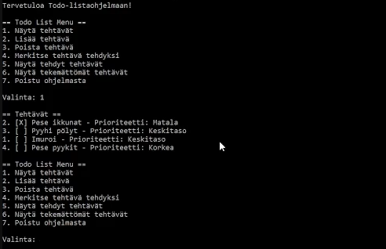

# ToDo List Application (F#)

This is a simple console-based ToDo List application built using F#. It allows users to manage tasks by adding, removing, marking them as complete, and viewing tasks based on their status (done or not done). Users can also filter tasks by priority (Low, Medium, High). All tasks are saved and loaded from a file, ensuring data persistence across sessions.
Features:

  - Add tasks with descriptions and priorities.
  - Mark tasks as completed.
  - Remove tasks.
  - View all tasks, completed tasks, and undone tasks.
  - Filter tasks by priority.
  - Persist tasks to a text file for storage.

This project demonstrates basic file handling, data persistence, and user input validation in F#.

## ToDo List Demo

Click the image below to watch the demo video:

