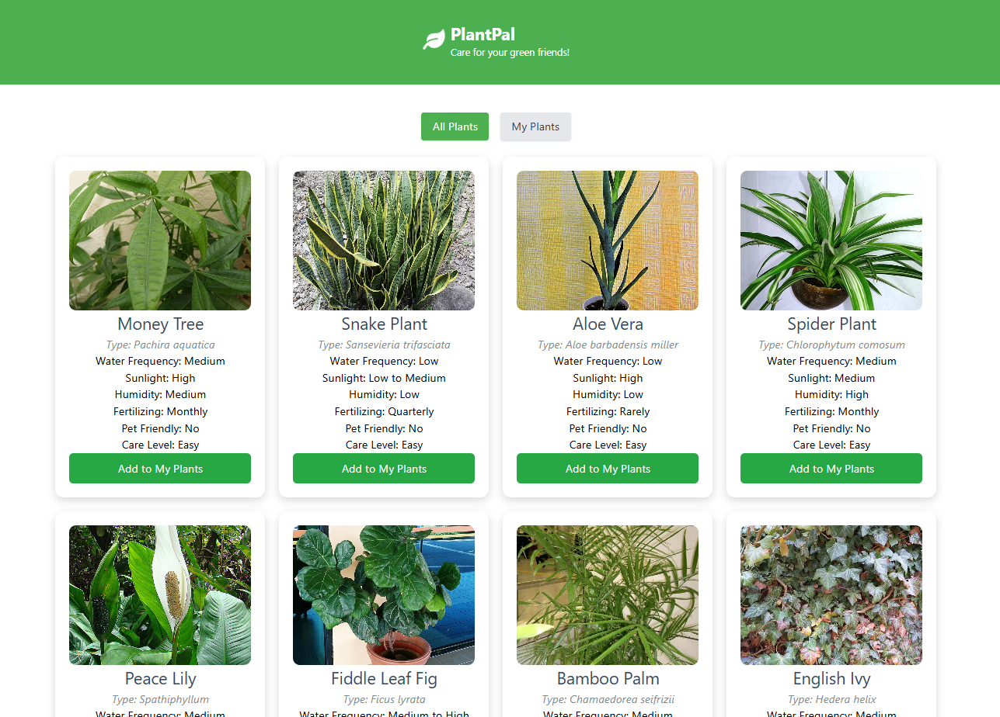

# PlantPal App

The **PlantPal App** is a web application designed for plant enthusiasts to manage their plant collections effortlessly. Built with React and Express, this app allows users to view, add, and manage their plants, ensuring they stay on top of watering and fertilizing schedules.

## Key Features
- **View Plants:** Users can browse a comprehensive list of available plants.
- **Personal Collection:** Add plants to a personal collection for easy management.
- **Care Schedules:** Manage watering and fertilizing schedules to keep plants healthy.
- **Responsive Design:** The app is optimized for various screen sizes, ensuring usability on mobile and desktop.

## Technologies Used
- **Frontend:** React, Axios, React Toastify
- **Backend:** Express, MongoDB (via Mongoose)
- **Styling:** CSS, Custom styles

## Project Status
This project is currently under development, with ongoing enhancements and feature additions. Feedback and contributions are welcome!

## PlantPal App Demo

Click the image below to watch the demo video:

