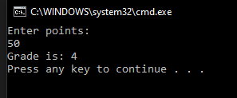

# T1 School number

Make a program that gives the student a grade according to the following table, the score is asked and the program prints the number. Check that the given value is a number, and give an appropriate error message if it is not.

