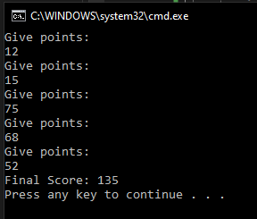

# T2 Hill jumping

Five judges are used in hill jumping. Write a program that asks rating points for one jump and prints the sum of the style points such that the smallest and largest style point has been subtracted from the sum. Save the given numbers to an arrayt. Check that the given input is a number.

