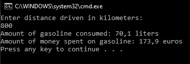

# T3 Consumption

Create a static method to calculate the cost of a certain trip. In the main program the user is asked for the distance driven, check that the given input is a number. After that, the main program calls the method sending the number of kilometers driven as a parameter. The method draws randomly consumption between 6 - 9 liters/100km. The fuel price is randomly selevted between 1,75 - 2,50€ per litre.

The method returns the amount of gasoline consumed and the amount of money spent on gasoline, the main program shows them to the user.

