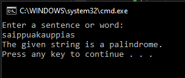
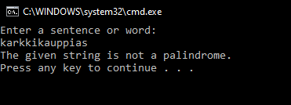

# T4 Palindrome

Make a program that asks an end user for a sentence or string. Create a static method for checking is the given sentence or word palindrome or not. The method has one argument, and it returns boolean value (true or false).  The program will show the end user if the given string was a palindrome.

**Is a palindrome**

**Not a palindrome**

