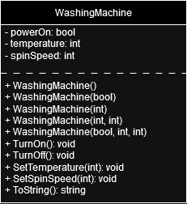
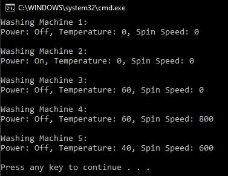

# T7 Washing machine

Design and draw the properties and functions of the Washing machine class as a UML class diagram. Attach the image to the project's repo.
Implement the programming of the Washing Machine class and the main program to create an object from the Washing Machine class.
Adjust the washing machine object with different values ​​from the main program. Use Console.WriteLine() print statements to show the user in the main program the state and use of the washing machine object.

Implement a few different constructors (at least two different ones) in the Washer class and initialize them using the object from the main program.

**UML class diagram**

**Prompt**

