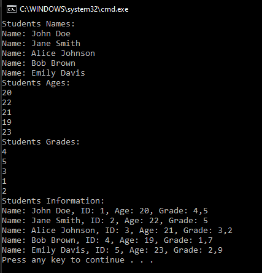

# T10 Student

Use the UML editor to design a Student class that contains the student typical information and functions. Create the Student class and implement the main program, which creates at least five students and stores the students in a collection (for example an array or a list).
Print the data for the students in the collections using the repeating structure.

**UML class diagram**

**Prompt**

