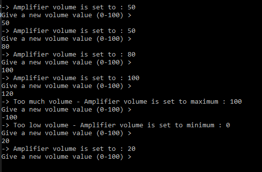

# T14 Amplifier

Your task is to program the operation of a simple amplifier that can
control the volume (Volume) between 0-100. Implement the Amplifier class and do
main program where you create an object from the Amplifier class. Adjust and test the amplifier
at different volumes. In the Amplifier class, use either:

  - a) methods for setting the volume or
  - b) get and set accessors using the property. the get accessor returns the volume and the set accessor sets the value of the volume.

In either case, limit the volume to the allowed range.

### Prompt

