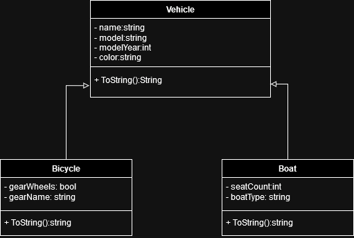
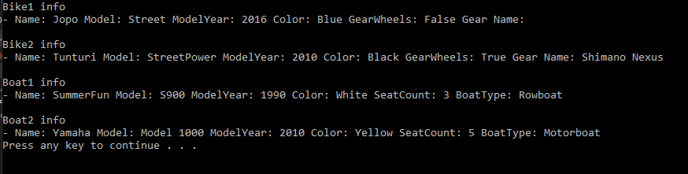

# T16 Vehicle

The implemented application should be able to handle different types of vehicles. All vehicles can be found as common characteristics: name, model, year model and color. As special cases, you must be able to handle bicycles and boats. Regarding the bicycle, you must be able to distinguish whether it is a geared bicycle or not and the model name of the possible gearbox. Regarding boats, the information must at least include the type of boat (rowing boat, motor boat, kayak, ...) and how many seats there are in the boat.

Research the goal/narrative of the task and implement the necessary UML class diagrams. After that, implement the required classes, create and use objects from the main program. Print the information of the objects of the required classes to the output window. There is no need to ask the application user for information, but you can initialize it directly in the main program.

### UML Diagram

### Prompt

