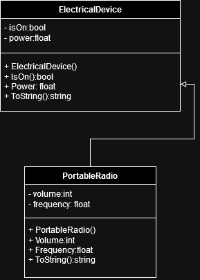
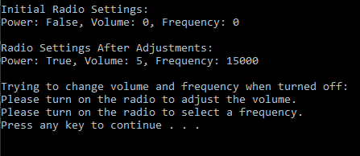

# T17 Radio

In the assignment, you must implement a C# program for testing the basic functions of the radio. The radio inherits the Electrical device class. The Electrical Device class has two properties:

1. boolean type on

2. float-type power (in watts).

The portable radio has three controls:

- on/off switch
- volume control (values ​​0, 1, 2,..., 9)
- frequency selection of the channel to be listened to (2000.0 - 26000.0).

Create a class to implement a portable radio.
Volume and channel cannot be set until the radio is turned on.
Use the class you made from the main program, i.e. test the functionality of the radio with different strengths
and with frequency values. Leave the setup and print statements visible in the main program so that the use of the radio object can be authenticated.
Implement the ToString() method for the class, which returns the values ​​of all radio settings.

### UML Diagram

### Prompt
