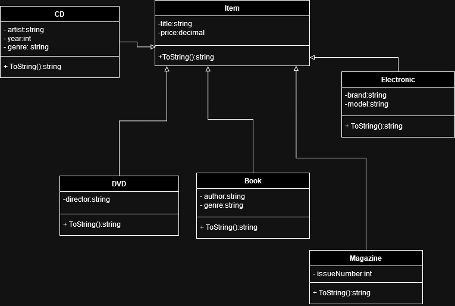
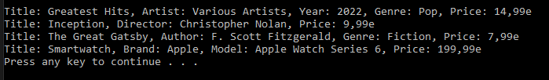

# T18 Student Goods

An ICT student's bookshelf contains a variety of items: books, magazines,
cds, dvds, blurays, phones, tablets, laptops, ... etc.

Using the UML diagram, consider what kind of class structures (at least for classes and properties)
occur and use the help of inheritance if the goods have some common characteristics.

After that, implement a few classes where inheritance occurs. Also make the main program,
where you use the classes you made and create objects.

### UML Diagram

### Prompt
