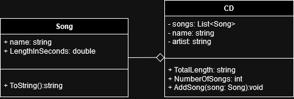
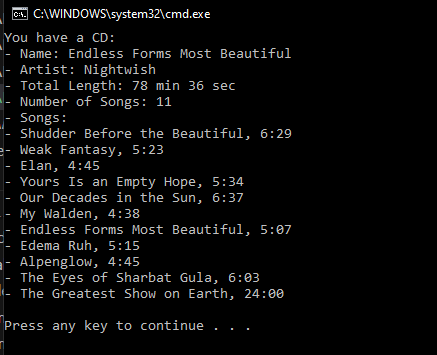

# T21 NewCD

In the previous demos, a CD class was made, which contained the common properties to a CD. The CD must have following information: name, artist, number of songs, total length and songs.

The songs inside the CD are objects from the Song class. The name and length of each song are saved. There is no limit to the number of songs on the CD.

The number of songs in the CD class is a read-only property that is counted as the number of song objects on the CD.
The total length of the CD class is a read-only property that is calculated as the sum of the lengths of the CD's song objects.

Create the CD category and the Song category that you have planned. In the main program, implement the CD object. You can come up with the information for the CD yourself and the main program will set it, you don't need to ask the user for it.

Check with careful testing that your class can count the number of songs and the total length correctly!

### UML Diagram

### Prompt 

