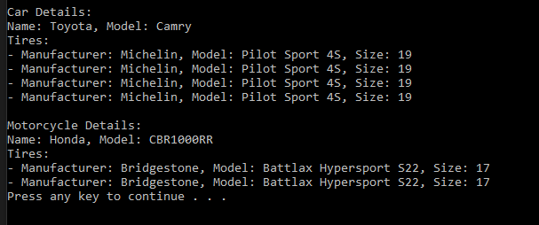

# T24 Vehicle

Make a Tire-class with the following properties:
Manufacturer, Model and TireSize.
After this, implement the Vehicle-class with the characteristics belonging to a vehicle (name, model, etc). Assemble the vehicle tires with Tire-objects, use strongly typed List. Make a main program where you create some vehicles (e.g. car and motorcycle) with tires. There is no need to ask the user for information, you can initialize it directly in the main program's code.

## Prompt

