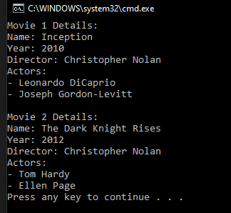

# T25 Movie stars

You have to create a small program for Movies. There are three classes: Movie, Actor and Director. The classes Actor and Director are inherited from a Human class. Create needed properties and methods for the classes. Make a main program where you create couple different Movie-objects with different actors and other data. You can ask movie information from an end-user or you can initialize them directly in the main program.

Movie

- Name:string
- Year: int
- Director: Director-object {readonly}
- Actors:List {readonly}

Human

- Name: string
- Birth year: int

## Prompt

