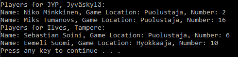

# T26 SMLeague

Implement a program that can add, delete and list SMLiiga teams (i.e. JYP, Kalpa, Tappara, etc.) players.
Create a Player class with the properties First Name, Last Name, Game Location and Number.
Also create a Team class. The class has properties Name, Hometown and Players.

The Players property is therefore a list of Player objects. The Team class has one constructor Team(string team). When the constructor is called, it is passed the name of the team to be created, i.e. 'JYP'. In this case, the constructor adds a few JYP players to the Players list. And correspondingly, when called with the parameter 'Ilves', Ilves players are added to the list.

## Prompt

