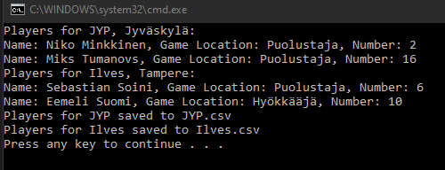

# T27 SMLeagueExport

This task continues the previous task.
Create the funtionality to save all players of the selected team to a csv file. For eaxmaple, if an end user chooses to save JYP's players, a file JYP.csv is created, and the players are presented in the file as follows:

Jarkko;Immonen;center;26

Brad;Lambert;forward;16

## Propmt
