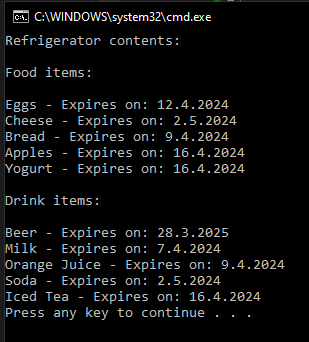

# T28 Refrigerator

Think about the refrigerator as a concept in the real world and especially what you can find there.

Make a small-scale implementation that compiles the contents of the refrigerator from a few different things/objects.

A refrigerator is therefore an entity that has a collection of different foodstuffs.

## Prompt

