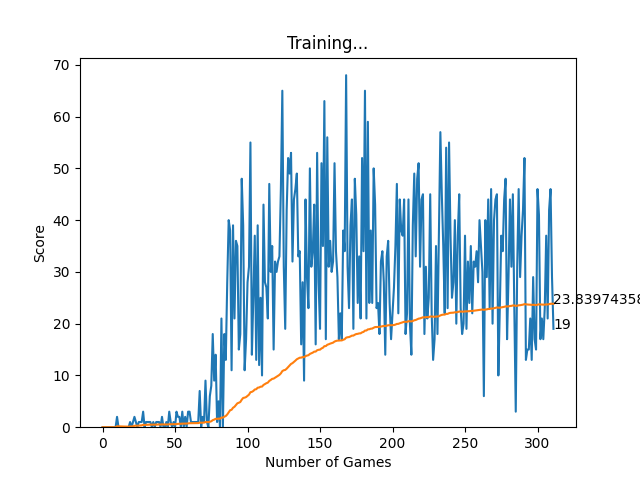

# Building an AI to Play Snake

##Project Description

The game's graphics and user interface were implemented using the Pygame library, and a font was set to display the game's score visibly. Two classes were defined: a Direction enumeration class to specify the possible movement directions of the snake, and a Point namedtuple that stores x and y coordinates as a single entity. The project also involves defining the colors displayed in the user interface using RGB codes, adjusting the snake's speed, and setting the size of the blocks that make up the snake and its environment.

The SnakeGameAI class initializes the game state, display, and clock, and contains methods for updating the snake's state, placing food, handling player input, and managing game events. It also detects when the snake collides with the walls or itself.

The game uses experience replay memory to store states, actions, rewards, and subsequent states along with game-over information. The AI uses this memory during training to learn the most effective actions in various situations. Short-term memory is trained after each game event, while long-term memory is trained at regular intervals. As a result, the AI learns by playing and improves its performance over time.

The primary reference for this project was a tutorial by Patrick Loeber, which covered many aspects of reinforcement learning. 
<a href='https://github.com/patrickloeber/snake-ai-pytorch'>Patrcik Kloeber Source Code</a>

### Snake game in action

### Snake game graph

