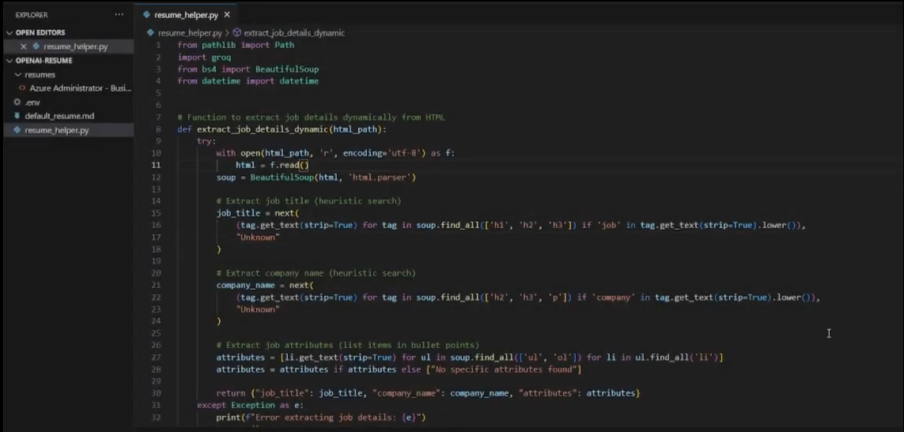

# Resume Helper

## Project Description:

**Job Application Automation**

This project automates the extraction of job descriptions from HTML resumes, identifies relevant skills from a predefined resume, and generates tailored job applications. Using Groq AI, it processes the job description and matches the skills from the user's resume to generate personalized responses. It then outputs these results in markdown files, making it easier for candidates to apply for roles with a professional, customized application.

***Key Features:***

  - Extracts job descriptions from HTML files using BeautifulSoup.
  - Matches relevant skills from a predefined markdown resume.
  - Uses Groq AI to generate tailored job descriptions and job applications.
  - Outputs matched skills and generated job applications in markdown format.

***Technologies:***

  - Python for backend logic and file handling.
  - Groq AI for natural language processing and text generation.
  - BeautifulSoup for HTML parsing.
  - Markdown for formatting output.

### Resume Helper Demo

Click the image below to watch the demo video:

