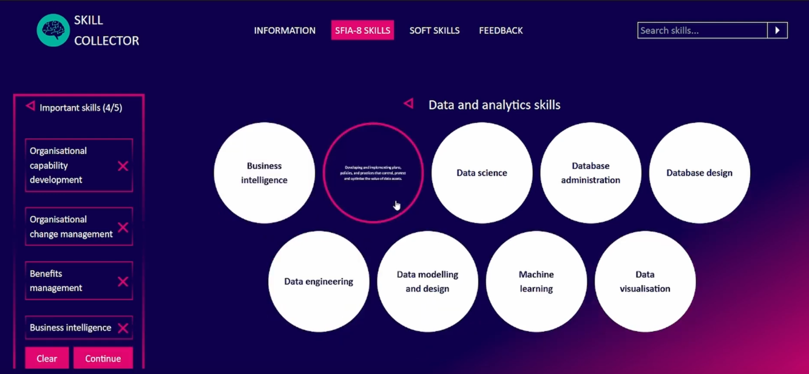

# Skill Collector UI

Skill Collector is a web application developed as part of a Future Factory course. The goal was to design and build an interactive questionnaire where users could input a hash code and select the most important, valuable, and relevant skills, including both technical and soft skills, from the SFIA-8 framework in the IT industry.

I was responsible for the UI design, and the final interface incorporates JAMK's brand colors. The app required users to select five skills from each group (important, valuable, and soft skills) before proceeding. To enhance usability, a search bar was provided to help users quickly locate specific skills. Given that there are 128 SFIA-8 skills in total, the challenge was to ensure the selection process didn’t become overwhelming or disorganized.

To address this, hovering over a skill displays a detailed description, providing users with additional context without cluttering the interface. This design approach aimed to balance functionality with a clean and user-friendly experience.

## Demo

Click the image below to watch the Skill Collector UI demo:

