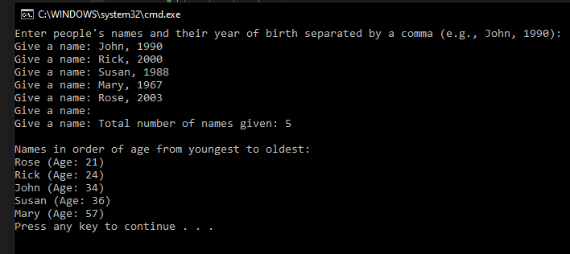

# T5 Names

Make a program that asks the user for people's names and their year of birth. Name and Year of Birth are separated by a comma. Entering names is finished by entering an empty entry. Create a struct to save and present people's data. After this, the program tells how many names were given and displays them in order of age from youngest to oldest.

