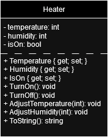
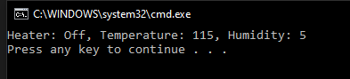

# T6 Sauna Heater

Your task is to program the operation of the electric sauna heater. You must be able to turn on the heater and besides, both its temperature and the humidity it gives must be able to be adjusted (values ​​are not limited).

Design the properties and functions of the Heater class as a UML class diagram. To draw a class diagram, you can use the Flow Chart Maker & Online Diagram Software service found on the web or, for example, the Violet editor installed on class machines.
You can install it on your home machine here: Violet UML editor.

Implement the programming of the Heater class and the main program to create an object from the Heater class.
Adjust the stove object with different values ​​in the main program, and show how your stove works with Console.WriteLine() print statements in the main program.

**UML class diagram**

**Prompt**

