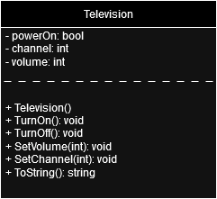
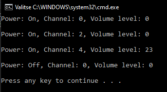

# T8 Television

Your task is to program the operation of the television. Same as the previous task:what features and functions would you add to the Television class?

Design and draw the properties and functions of the Television class as a UML class diagram.

Implement the programming of the Television class and the main program to create an object from the Television class.
Adjust the Televsio object you created with different values. In the main program, show the user how to use the TV object and the properties after adjustment.

**UML class diagram**

**Prompt**

