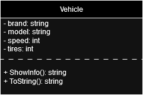
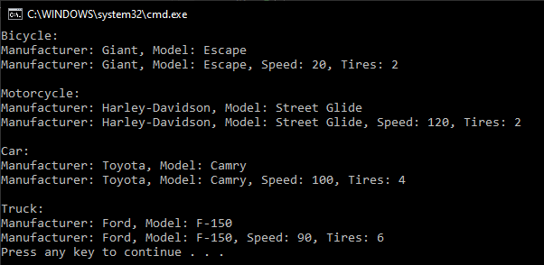

# T9 Vehicle

In the specification, it has been identified that the application needs to handle different vehicles, which are: bicycle, motorcycle, car, truck. A class in design it has been decided to create a Vehicle class to represent vehicles. There are vehicles identified the following common characteristics: manufacturer, model, speed and tires number. Create a Vehicle class with the following information:

**properties**

- Brand: string
- Model: string
- Speed: int
- tires: int

**methods**

- ShowInfo():string, returns Vehicle manufacturer and model information as a string
- ToString():string, returns all Vehicle properties as one string, so you have to override base class ToString()

Implement the programming of the Vehicle class and the main program, which creates at least two objects from the Vehicle class. After creation, change the object's properties and print the object's information to the console using either method.

**UML class diagram**

**Prompt**

