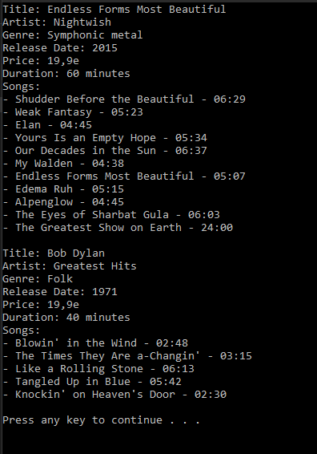

# T11 CD

Use the UML editor to design a CD class that contains as properties typical information belonging to a CD.
Also consider what different functionalities the CD could have. At least implement the functionality,
which returns the values ​​of all properties as a single string (using it in the main program you could
prints all the information on the CD).
Implement also the Songs property for the class. Songs can be either in an Array or in a list (List), prefer List. The Songs collection represents the songs on the disc. In this task, a song can be either:

- string
- record
- struct
- tuplee
- Song-object.

Program the CD class you designed in C#. Implement CD objects in the main program.
You can come up with the information yourself, you don't need to ask the user for it. Print the CD information with songs on the screen.

### UML Diagram

### Prompt

