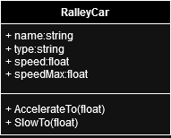
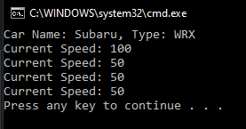

# T12 Ralley car

Implement the RalleyCar-class with the following properties:

- Name (string)
- Type (string)
- Speed(float)
- SpeedMax(float)

Implement the class with the following methods:

- AccelerateTo(float)
- SlowTo(float).

The properties Name and Type can be read and changed without restrictions.

Implement other properties so that they have an in-class background variable that the class uses.
The SpeedMax property is read-only and its value is set by default permanently to 200. The initial value of the Speed ​​property is zero and cannot be set

directly, but its value can be read. The value of the Speed ​​property can only be changed through the methods AccerelateTo(float) and SlowTo(float) so that Speed
cannot be less than zero or greater than Speedmax. If the value given to the methods is not within the allowed range, then the method does not change the Speed ​​value. Execute the main program TestRalley, with which you test the setting of various features.

Please note the following! Accessors generally do not throw exceptions, and that an accessor does not return anything.
Question: When calling the methods of the main program should an end-user somehow need to know that the method didn't set the speed to the requested value?

### UML Diagram

### Prompt

