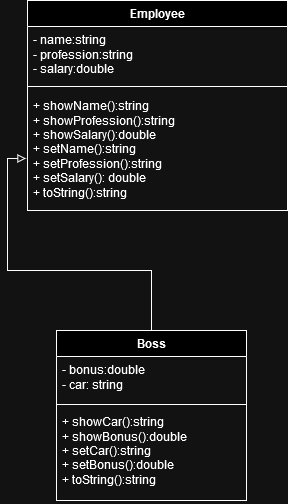
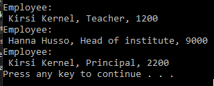

# T15 Employee

The program must be able to process employee data (Employee). Regarding employees, you must be able to process the following information: employee's name (Name), employee's profession (Profession) and salary (Salary). In the same program, you must also be able to process the managers' data (Boss), they also have a car (Car) and a salary bonus (Bonus).

Research the goal/narrative of the task and implement the necessary UML class diagrams. After that, implement the required classes, create and use objects from the main program. Print the information of the objects of the required classes to the output window. There is no need to ask the application user for information, but you can initialize it directly in the main program.

### UML Diagram

### Prompt

