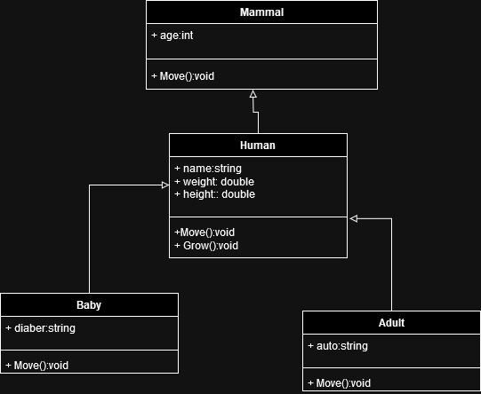
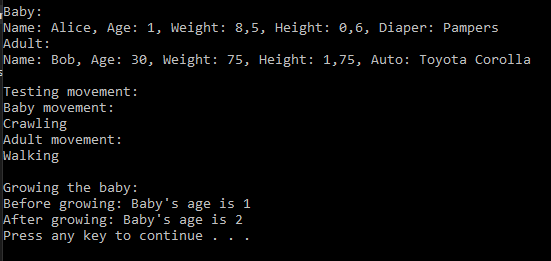

# T20 Mammal

In the task, a few classes must be implemented, which will be used to test the functionality of abstract methods.
Create an abstract class Mammal, which has an Age property, The class has also Move-method, the implementation of the method is unimplemented because it must be an abstract method.

Inherited Human-class from Mammal-class, which has properties generally related to humans, like weight, height and name. Add to the Human-class the following methods: Move and Grow. The first prints "Moving" to the console and the latter increases the person's age by one year. Note that the Move-method and the Age-property are in the Mammal-class

Inherit the Baby- and Adult-classes from the Human-class. In the Baby-class, override the Move-method of the superclass to print the "Crawling". Overwrite the same method in the Adult-class as well and set it to print "Walking". Add the Auto (String) property for the adult. Add a diaper (String) feature to the baby.

In the main program, implement a few people, adults and babies. Print object information to the console.

### UML Diagram

### Prompt
