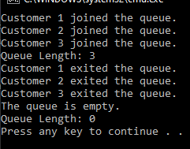

# T23 Queue

Implement a solution that simulates the flow of customers at a store checkout. Implement the class Checkout Queue, which uses a queue, i.e. the Queue data structure.
The checkout queue class could have methods:

- GoToQueue(parameters)
- ExitQueue(parameters)
and a property:
- Length

You can also design and implement your own interface for the class. Note: in this context interface means public properties and methods visible from the outside of the class.

## Prompt
