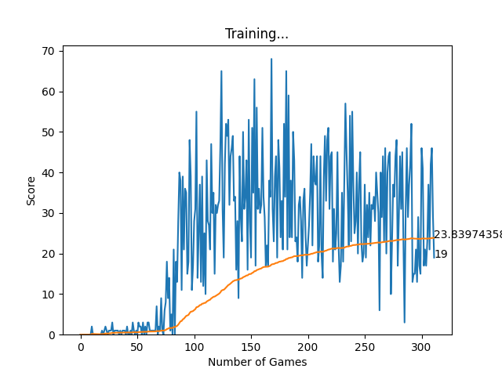

# Matopeliä pelaavan tekoälyn rakentaminen

## Projektin kuvaus

Pelin grafiikat ja käyttöliittymä toteutettiin Pygame-kirjaston avulla ja fontti määriteltiin, jotta pe-lin pisteet voitaisiin tulostaa näkyviin. Luokiksi määriteltiin Direction-enumeraatioluokka, jolla voi-daan määritellä käärmeen mahdolliset liikesuunnat, sekä Point-niminen namedtuple, joka tallentaa x- ja y-koordinaatit yhdeksi kokonaisuudeksi. Alussa määritellään myös värit, joita käyttöliittymässä näytetään RGB-koodein, sekä säädetään käärmeen kulkema nopeus, sekä blokkien koko, josta käärme ja ympäristö koostuu.

SnakeGameAI-luokka alustaa pelin tilan, näytön ja kellon ja sisältää metodit käärmeen tilan päivittämiseen, ruoan sijoittamiseen, pelaajan syötteen käsittelyyn ja pelivaiheiden suorittamiseen. Se myös tunnistaa, jos käärme törmää kentän seiniin tai itseensä.
Pelissä käytetään kokemusmuistia, joka tallentaa tilat, toiminnot, palkinnot ja seuraavat tilat ja pelin päättymisen tiedot.

Tekoäly käyttää tätä muistia koulutuksessaan oppiakseen tehokkaimmat toiminnot eri tilanteissa. Lyhytaikaismuisti koulutetaan jokaisen pelivaiheen jälkeen, kun taas pitkäaikaismuisti koulutetaan säännöllisin väliajoin. Tekoäly oppii näin pelatessaan ja parantaa suori-tustaan ajan myötä.
Lähteenä toimi Patrcik Kloeberin tutoriaali, joka avasi monia vahvistetun oppimisen osa-alueita. 
<a href='https://github.com/patrickloeber/snake-ai-pytorch'>Patrcik Kloeber Source Code</a>

### Snake game in action

### Snake game graph

